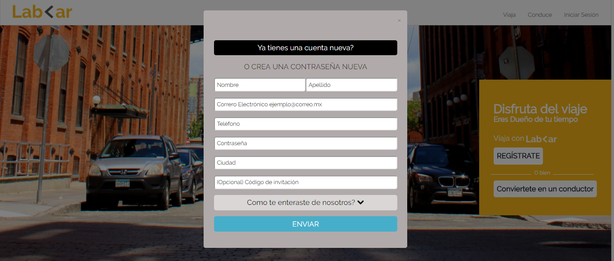
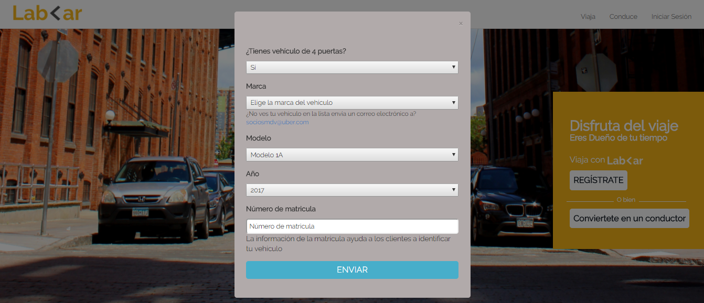

# "LabCar"

LabCar nueva app que va ayudar a la gente a librarse de los atascos y pueda, así, disfrutar de más tiempo para sí misma. A la vez una opción flexible para incrementar tus metas financieras.


## Desarrollado para 

[Laboratoria](http://laboratoria.la)

## Objetivo

  Recrear la  página web de LabCar

## Recursos

### Visual Studio Code

Editor de código fuente.

### Jquery

Librería de JavaScript de código abierto que permite agregar interactividad y efectos visuales.

### Bootstrap

 Framework que permite facilitar el desarrollo.

### Google Fonts

Directorio interactivo que permite añadir tipografias a la web.

## Resultado

* **Página en Mobile**

***


* **Página en Desktop**

***


* **Modal 1: Iniciar Seción**

***
  

* **Modal 2: Modal Registrece**

***
  

* **Modal 3: Convierte en conductor**

***
  

## Desarrollado por 

 ```bash
   Eleyne Karina Ramírez De la Cruz
   ```